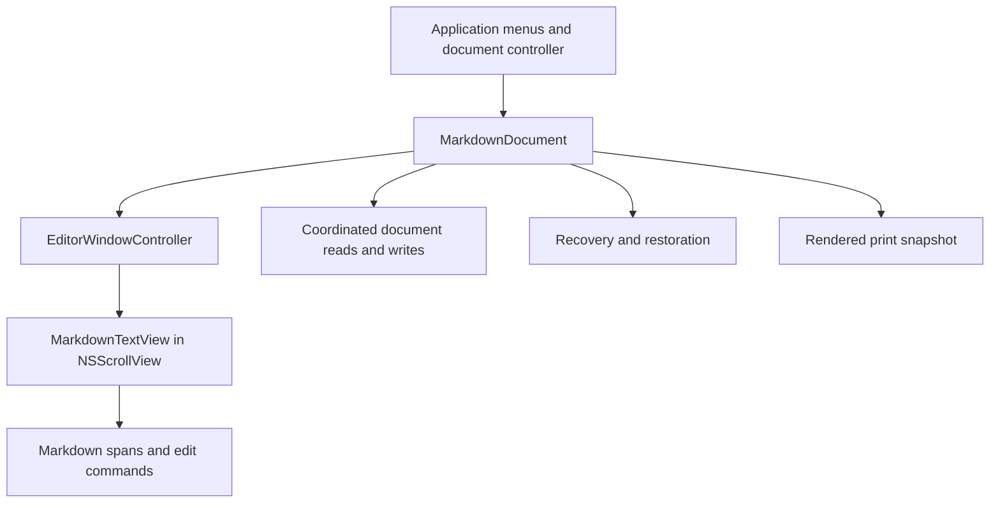

# mdwrite Native macOS Migration Plan

## Goal and scope

Build **mdwrite**, a native macOS Markdown writing app that preserves the focused, single-editor experience of the current Qt application. Deliver a native Swift/AppKit application rather than a macOS skin around Qt. Use SwiftUI only for isolated settings or informational views where it simplifies implementation.

This is an implementation plan, not a claim that the port exists. The task ledger is [macos-port-tasks.md](macos-port-tasks.md). Platform evidence is collected in [macos-research.md](macos-research.md). Proposed choices below remain subject to the two feasibility gates; product changes require an explicit entry in the parity matrix.

## Proposed defaults

- Product, executable, and bundle display name: `mdwrite`; native artifact: `mdwrite.app`.
- Native code under `macos/`; shared behavior fixtures under `tests/fixtures/`. Keep the Qt implementation usable as the behavior reference until release acceptance.
- Swift 6 language mode, macOS 14 minimum, Apple silicon first; build Intel compatibility before release if the chosen dependencies support it. Test the minimum OS and current stable OS, not just the development machine.
- AppKit document application with `NSDocument`, `NSDocumentController`, `NSWindowController`, `NSTextView`, and `NSScrollView`. One document per window, all windows in one process.
- Explicit Save/Save As and dirty-document confirmation remain the product contract. Evaluate autosave elsewhere for recovery; do not enable autosave in place without a recorded product decision.
- Start with TextKit 2 in a bounded prototype. Test a deliberate TextKit 1 implementation if syntax elision fails. Choose one engine after measuring editing correctness, accessibility, and performance.
- Direct distribution as a Developer ID signed, notarized app; sandbox enabled from the first native target. App Store submission and automatic updates are later work.
- No network dependency for writing, editing, saving, searching, or printing. Open permitted links through the system browser. Bundle existing fonts and their license.

The macOS version and distribution defaults are proposals, not discovered requirements. Freeze them in task M01 before platform-specific implementation. A final bundle identifier must use a namespace controlled by the publisher; use a clearly provisional development identifier until then.

## Current behavior and migration contract

The source of truth is the code, including behavior not covered by the existing ten Qt test methods. M01 records exact examples and expected results before rewriting.

| Current location or behavior | Native replacement and acceptance |
| --- | --- |
| `backend.cpp`: open/save, safe filenames, last save directory | `MarkdownDocument` owns plain-text content and saves. Panels, Finder Open With, recent documents, errors, and canceled operations preserve user text. |
| Dirty close/open and save-for-close dialogs | Standard document sheets; quit with multiple dirty windows is cancellable and cannot close a window after a failed save. |
| Recovery JSON and locks per process/window | Per-document autosave-elsewhere or an app-owned journal selected by M03. Recover unnamed and named drafts independently after forced termination. |
| File watcher, own-save suppression, removed-file warning | Document coordination and tested conflict policy; same-content changes are ignored, external text never replaces dirty local text silently. |
| `markdownhighlighter.cpp` | Pure span analysis plus display styling for headings, lists, quotes, rules, inline code, bold, italic, and links. Preserve current syntax subset; changes such as full CommonMark support are separate decisions. |
| Hidden bold/italic/link markers and cursor skipping | Source remains unchanged; caret movement, selection, hit testing, delete, clipboard, and accessibility remain coherent. Display-only changes do not dirty the document. |
| `EditorMutations.js` and editor handlers | UTF-16 range based edits; bold/italic/link actions, escaped destinations, URL-over-selection paste, newline normalization, smart paragraph/list/quote return, Shift-Return, and paired-break deletion. |
| Find, next/previous, replace and replace all | Source-based literal, case-insensitive search; highlight and reveal matches inside elided syntax. Replace All is one undoable action; document windows isolate search state. |
| Word count and suggested filename | Fixture parity for apostrophes, hyphens, non-Latin text, numbers, empty documents, slash/control character removal, and filename length. |
| `printDocument()` renders Markdown | Native print sheet and PDF output from a separate rendered snapshot, not hidden editing glyphs. Match representative printed headings, paragraphs, lists, quotes, code, and links. |
| Omarchy theme, portal text size and custom wheel animation | macOS dynamic colors, accent, AppKit appearance, native scrolling and Retina layout. Provide app font-size controls instead of assuming a Linux text-scaling setting exists on macOS. |
| New window, fullscreen, shortcuts, window geometry | Native document windows, macOS menus and responder chain, restoration, and screen-safe frame recovery. Use Command shortcuts; reserve Command-H for Hide and Control-Command-F for fullscreen. Find/replace uses a suitable Edit menu command rather than Command-H. |

## Architecture and ownership

`MarkdownDocument` owns persistence, document identity, dirty state, and its undo manager. NSDocument may load before any editor exists: retain an immutable loaded snapshot for initial attachment, headless serialization, and recovery. After attachment, the editor's text storage is the authoritative live text; document serialization reads a versioned snapshot rather than maintaining a second independently editable string. Background analysis consumes immutable snapshots and discards stale results; AppKit view and text mutations stay on the main actor.

`EditorCore` contains Foundation-only Markdown span analysis, edit commands, word count, filename suggestions, and URL policy. Commands return replacement text and selection as checked UTF-16 ranges; they do not perform file I/O or create views. The AppKit adapter applies a command as a native text edit with one undo group and uses one dirty-state mechanism: document undo-manager tracking or explicit change-count updates, selected and tested in M03. Avoid double counting; undo to the saved baseline must clear dirty state. Highlighting attributes and theme changes are presentation, not source edits.

`DocumentIO` works through the chosen NSDocument read/write hooks and coordination mechanism. Use supplemental file and parent-directory observation because file presenters do not see every uncoordinated write. Rearm observation after atomic replacement and recheck move/delete/recreate events. Keep this observation behind DocumentIO rather than introducing a competing writer or presenter. Recovery and conflict decisions have one owner; restore must not trigger a second simultaneous recovery system.

Printing uses a snapshot and a separately tested Markdown-to-attributed-text renderer. Evaluate Foundation Markdown parsing against the required block subset in M02; if insufficient, choose a pinned, licensed parser in M08 rather than assuming inline parsing covers block printing.

## Data safety and compatibility

Use UTF-8 plain Markdown. M01 defines invalid-byte handling, UTF-8 BOM policy, line-ending preservation versus normalization, trailing newline behavior, and all source/selection conversions. New documents use LF; opening and saving unchanged valid UTF-8 files must preserve their content according to the recorded policy. Never replace an undecodable file with lossy text without user intervention.

During a save, capture the document revision and baseline disk version. Coordinate writes, check external changes against the baseline, and retain dirty state if newer edits arrive during a save. Failure, denied permission, read-only volume, or Save As cancellation leaves the original file and draft intact. Record whether file identity, permissions, aliases, and symlinks are preserved or intentionally resolved.

External edits, file deletion/move, and conflicting recovered drafts need deterministic choices: reload only after consent where local work would be discarded; keep the local draft; save a copy. A conflict stays unresolved until an explicit choice or verified unchanged disk baseline. Retain both a local snapshot and the external version before an authorized overwrite. Baseline checks cannot eliminate races with noncooperating writers; describe this limit and test it without claiming universal file locking. Test changes during an open save panel, during the write, and during restore.

Recovery writes are atomic, versioned, and identified by stable document UUIDs. Named recovery records carry baseline identity and a sandbox bookmark when available. Deleted files or denied bookmark access recover as untitled copies rather than overwriting unrelated files. Remove snapshots only after confirmed save/discard of the corresponding revision; retain any snapshot containing edits newer than a completed asynchronous save; terminate during each cleanup transition in tests. Define and measure the debounce window, including potential edits since the last committed snapshot.

The rename must not strand existing Qt settings or recovery files. Preserve their legacy storage namespace during the Qt rename or implement an idempotent migration with fixtures. The native app can offer explicit import of Qt recovery JSON from an authorized folder; it must not crawl outside its sandbox or delete originals. Linux recovery import is portable file import, not automatic access to another machine's home directory.

## Phases and release gates

1. **Contract and rename:** inventory behavior, fix scope, create fixtures, and rename visible app/build/package/test identifiers to mdwrite with storage compatibility.
2. **Feasibility:** prove syntax elision and document/recovery semantics separately. Stop dependent work if either gate fails; revise the design and repeat that gate.
3. **Native vertical slice:** a launchable document app opens, edits, saves, closes, and reopens Markdown, with correct undo and native menus.
4. **Parity:** implement editing commands, highlighting, find/replace, recovery/conflicts, printing, and appearance; merge only against the shared contract.
5. **Hardening and release:** accessibility, large-document performance, OS/architecture matrix, sandbox persistence, signing, and notarization. Keep the Qt reference until the release gate passes.

The two feasibility gates are intentionally first. Elision must pass Unicode/IME, VoiceOver, copy/paste, navigation, delete, search, and undo checks. Persistence must pass canceled save/quit, failed save, named/untitled crash restore, and external-write scenarios. A visibly dimmed source mode is an acceptable prototype fallback; making it the final default changes the product and must be recorded before proceeding.

Performance targets are proposed budgets: deterministic 1 MiB and 10 MiB Markdown fixtures, p95 ordinary keystroke handling below 16 ms on a recorded reference machine, and 10 MiB open below 2 seconds after launch. Measure baseline, memory, and full-layout work in M02, then confirm or revise budgets before treating them as gates. Bounded recomputation and stale-result rejection must prevent typing latency from scaling with every full document scan.

Release acceptance requires every parity row to be accepted or explicitly deferred, automated core/document tests passing, manual IME/VoiceOver and visual checks recorded, and a fresh-machine install/open/save/print/recovery smoke test. Signing credentials are required only for release packaging; missing credentials do not block local builds or tests. Do not remove Qt, publish packages, or submit to the App Store as an implicit consequence of a task finishing.

## Review and unresolved decisions

Initial review found that hidden markers, UTF-16 indexing, autosave-in-place, external-save races, rendered printing, and identity migration were under-specified. This plan makes each a named gate or task with observable acceptance criteria. A source-grounded second review added mandatory observation for uncoordinated writes, pre-window document loading, single-owner dirty tracking, and revision-specific recovery cleanup. A future review must check actual prototype evidence before architecture is considered proven.

Still to resolve in M01–M03: deployment floor and architectures, publisher bundle namespace, exact newline/encoding contract, which text engine passes elision, and whether NSDocument autosave elsewhere alone satisfies the explicit-save recovery policy. These are bounded implementation decisions with named owners, not reasons to start a broad rewrite before the spikes pass.

Local environment inspected on 2026-09-30: Swift 6.4 and Command Line Tools are installed; full Xcode is not selected, and neither `qmake6` nor `qmake` is on PATH. Project-level XCTest/UI and Qt validation therefore require provisioning the relevant toolchains. A plan or static rename check is not evidence that either application builds.
