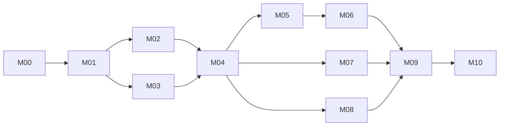

# mdwrite Agent Implementation Tasks

## Execution contract

Use [the migration plan](macos-port-plan.md) as the product contract and [the platform research](macos-research.md) for API evidence. These tasks authorize implementation work only when the user starts that workflow; implementation was authorized by the user after the initial planning commit. Implementation progress and its evidence are recorded in [the behavior contract](macos-behavior-contract.md).

A coordinator selects the next ready task, gives one agent ownership of its files, and records status, branch or commit, checks, and findings here. Use isolated branches/worktrees when available. Keep dependency/toolchain setup under coordinator ownership; never have two agents edit an Xcode project, scripts, or the same integration file concurrently. Parallelize only the independent work identified below, after the shared interfaces and fixtures are merged.

For each task, the implementer reads the named source and dependent artifacts, writes a small reviewable change, and runs its acceptance checks. A separate reviewer checks requirements and failure paths, not just code style. Revise until every blocking finding is fixed and rechecked; rerun only affected checks. Handoff includes exact commands/results, manual evidence, remaining limitations, and changed interface contracts. Update this ledger after integration, not after merely submitting a patch. Do not manufacture a passing result when the required toolchain is absent.

### Agent task prompt

> Implement TASK_ID from docs/macos-port-tasks.md. Read its dependencies, the migration contract, repository guidelines, and listed source. Stay inside the file ownership boundary. Add or update behavior tests before declaring the acceptance criteria met. Provide the patch, validation commands/results, and unresolved risks. Stop dependent work and propose a concrete correction if a gate fails. Do not sign, publish, delete the Qt reference, or change product scope as an incidental step.

## Tasks and acceptance

### M00 Rename the existing application

- [x] Implementation: rename Qt build target/project, binary paths, package assets, display strings, and test identifiers to `mdwrite`. Retain the old storage namespace and upstream URL; do not imply the upstream package was republished.
- **Current change:** `mdwrite.pro`, `tests/tst_mdwrite.cpp`, `pkgbuild/mdwrite.*`, scripts, README, and application display strings. `src/main.cpp` keeps `omawrite` only as the internal persistence identity.
- **Review still required:** Qt build/test execution and upgrade smoke test once Qt 6 is installed. Verify existing recovery snapshots, last-save directory, window geometry, icon lookup, and launch with a file argument. Confirm the renamed Arch package conflicts with/provides the old package without publishing it.
- **Status:** implementation complete; static rename and shell syntax checks passed; runtime acceptance pending toolchain. M00 is accepted only after these checks pass. The existing `AGENTS.md` is preserved; its historical Omawrite paths must be reconciled when contributor-document updates are authorized.

### M01 Freeze behavior fixtures and product choices

- **In progress:** source-derived contract and 73 fixtures captured; 35 QML/JS handler examples and seven Swift test groups pass. Qt runtime acceptance remains pending. See [macos-behavior-contract.md](macos-behavior-contract.md).
- **Dependency refinement:** the source contract, portable module preparation, and source-only checks may proceed while M00 runtime evidence is unavailable. This does not accept M00/M01. The later launchable-app directive permits a development vertical slice while production gates remain open. Keep the missing Qt/portal validation explicit.
- [ ] **Dependencies:** M00 runtime acceptance for a runnable Qt baseline. **Owner/files:** contract agent; `tests/fixtures/`, parity contract documentation, this ledger.
- Read `src/Main.qml`, `src/EditorMutations.js`, `src/backend.cpp`, `src/markdownhighlighter.cpp`, and `tests/tst_mdwrite.cpp`. Record all migration-plan parity rows as test cases or manual scripts, including current quirks and intentional native differences.
- Choose macOS minimum, architectures, development bundle identifier, explicit-save policy, encoding/BOM/newline policy, and error/conflict vocabulary. Add examples for source spans, Unicode, smart Return, pasted links, source copy, and rendered printing.
- **Acceptance:** each behavior has a fixture or manual acceptance script and an explicit native expectation. Invalid UTF-8, BOM, CRLF, trailing newline, emoji/combining text, and escaped Markdown are covered. No requirement depends on guessing current behavior.

### M02 Prove the native text engine

- **Development evidence:** TextKit 1 source mode is integrated with dimmed markers, native undo, and main-actor presentation styling. Full syntax elision, engine comparison, IME/VoiceOver, and large-file measurements are pending. This is the recorded interim fallback, not acceptance of the elision gate.

- [ ] **Dependencies:** M01. **Owner/files:** editor spike agent; `macos/Spikes/Editor/`, text-engine decision and measurements.
- Compare TextKit 2 with explicitly constructed TextKit 1 as necessary. Keep source text unchanged while styling and hiding inline markers. Measure source/display range mapping, layout, hit testing, and large-file editing. Evaluate rendered Markdown APIs for printing separately.
- **Acceptance gate:** demonstrate arrows and modified navigation, selection through hidden spans, mouse selection, backspace/delete, word movement, wrapping, URL paste, one-step undo/redo, source-copy behavior, marked-text IME composition, emoji/combining characters, and VoiceOver. Styling alone changes neither undo nor dirty state. Record engine selection and 1 MiB/10 MiB latency/memory results on named hardware.
- **Failure path:** expose dimmed source in the spike, identify failed behavior, and revise the engine/design. Keep final hidden-syntax requirements explicit. The later launchable development milestone may proceed in source mode; production acceptance still requires this gate.

### M03 Prove document persistence and recovery

- **Development evidence:** a document-owned storage, native undo-driven dirty state, synchronous coordinated Save through `super.writeSafely`, one app-owned recovery journal, and external baseline checks are integrated. Earlier smoke passed Save/undo/recovery/conflict checks. Exact permission and failed-Save-As additions await native execution; the full failure matrix remains pending.

- [ ] **Dependencies:** M01; can run alongside M02. **Owner/files:** document spike agent; `macos/Spikes/Documents/`, persistence decision and failure fixtures.
- Prototype sandboxed NSDocument with explicit Save, autosave elsewhere, undo-driven change counts, and named/untitled recovery. Prove coordination with in-place autosave disabled. Add supplemental observation for uncoordinated external writes, including inode replacement; define baseline and conflict retention.
- **Acceptance gate:** cancellation, failed saves, save-while-editing, multi-window quit, forced termination, dirty/clean external changes, move/delete/recreate, stale bookmarks, denied access, same-content changes, and app-owned save events have deterministic outcomes. Undo to the saved baseline clears dirty state without duplicate change counts. Disk files remain unchanged before explicit Save. Recover independently per document without overwriting a conflicting disk version.
- **Failure path:** choose a single app-owned recovery journal or explicit coordination adapter where the prototype proves NSDocument insufficient. Bound and disclose the remaining race with tools that do not cooperate with coordination.

### M04 Create the native app and working document slice

- **Launchable development milestone achieved:** SwiftPM builds an AppKit executable and `./bin/build-macos` creates a sandboxed, ad-hoc-signed `build/mdwrite.app`. The app launched on the development Mac; native menus/editor/footer and a saved document window were observed. The later user directive authorizes this interim slice before complete M02/M03 acceptance.
- **Execution refinement:** CLT plus SwiftPM replaces the Xcode-project prerequisite for the local app. `NativeApp/`, `Info.plist`, entitlements, bundled fonts/licenses, `bin/build-macos`, `bin/run-macos`, and `bin/test-macos` are present. Full Xcode UI-test setup and complete lifecycle acceptance remain later gates.

- [ ] **Dependencies:** accepted M02 and M03. **Owner/files:** integration agent; `macos/mdwrite.xcodeproj`, shared scheme, app entry, document/window scaffolding, scripts.
- Maintain the reproducible SwiftPM application build; add an Xcode UI-test project/pipeline for hardening. Include AppKit editor, sandbox entitlements, document types, fonts/license resources, and provisional app icon. Support Finder Open With and recent documents. Use owned bundle namespace before distribution.
- UI-test prerequisite: full Xcode with the selected macOS SDK, accepted license, and active developer directory. Compatible Command Line Tools are sufficient for the development app and Swift Testing core. Handle load before window creation with an immutable initial snapshot and headless read/write/recovery support.
- Keep `./bin/build-macos`, `./bin/run-macos`, and `./bin/test-macos` reproducible with deterministic output directories and local ad-hoc signing. Future `xcodebuild` checks must name their project and scheme explicitly. Keep Qt commands functional.
- **Acceptance:** a clean checkout builds `mdwrite.app`; opening, typing, undoing, explicit saving, closing, and reopening a Markdown file works through menus and panels. No Qt framework is linked in the native bundle. Document windows isolate content and undo state. Swift Testing core checks pass; future Xcode UI tests run through a committed shared scheme.

### M05 Implement pure editing and Markdown behavior

- **Implemented development slice:** Foundation module and 73 fixtures exist under `macos/EditorCore/`; native source commands are integrated. Seven Swift test groups pass. Complete fixture execution through AppKit and runtime acceptance remain pending.
- [ ] **Dependencies:** M04 and M01 fixtures. **Owner/files:** core agent; `macos/EditorCore/`, core test files.
- Implement checked UTF-16 span analysis, mutation commands, word count, suggested names, newline rules, and URL policy. Preserve current Markdown subset; use existing C++/JS as a reference, not a native runtime dependency.
- **Acceptance:** fixtures pass for formatting/link commands, trimmed whitespace, escapes, list/quote continuation and exit, numbered list increment, fenced-code Return, soft Return, paired-break deletion, accepted clipboard schemes, and invalid/out-of-range selections. Tests check outcomes rather than copying implementation logic.

### M06 Integrate native editor and find commands

- **Development slice:** native source editing, formatting, smart Return/paste, and NSTextView find/replace menus are connected. Marker elision, safe link opening, complete command/search UI evidence, and IME acceptance remain pending. Review fixed distant Replace All styling and deferred appearance changes during composition; a separate source review confirmed both blockers resolved. These refinements build but await native revalidation.

- [ ] **Dependencies:** M05 plus accepted M02. **Owner/files:** editor agent; `macos/Editor/`, editor adapter tests.
- Connect the selected engine to document text/undo; apply display-only spans, source-preserving clipboard behavior, safe link opening, and contextual marker visibility. Add literal source find, next/previous, replace, and Replace All through a native find bar or an equivalent AppKit controller.
- **Acceptance:** M02 editing tests still pass after integration. Search reveals matches in hidden syntax; replacements do not split graphemes incorrectly or use stale ranges. Replace All and formatting each undo in one action; search/theme restyling preserves dirty state and focus. Background highlighting cannot apply an outdated document revision.

### M07 Integrate recovery and external conflicts

- **Development slice:** atomic version-1 per-document journal, recovery as untitled copies, one-second path polling, explicit conflict sheets, and save-time baseline checks are implemented. Older smoke verifies journal cleanup and conflict rejection. Bookmarks, legacy import, forced-termination/multi-window tests, and full M03 acceptance remain pending.

- [ ] **Dependencies:** M04 and accepted M03; can run alongside M05. **Owner/files:** persistence agent; `macos/Documents/`, document integration tests. Changes to shared app/window scaffolding go through the integration owner.
- Implement the selected recovery mechanism, coordinated reads/writes, observation, baseline comparison, sandbox bookmarks, schema versioning, and deterministic conflict sheets. Add optional user-selected import for legacy Qt recovery JSON, retaining originals.
- **Acceptance:** M03 failure matrix passes in the integrated app. Recovery survives forced process termination and multiple dirty windows; successful Save/Discard cleans only the correct snapshots and saved revisions, retaining newer edits. Save completion does not mark newer edits clean. Legacy import is idempotent, rejects malformed records, and restores inaccessible files as untitled copies. Test recovery version upgrades and shutdown during cleanup.

### M08 Implement native appearance and rendered printing

- **Development slice:** bundled typography, word-count footer, native scrolling/appearance, text-size controls/fullscreen, and a separate subset Markdown print renderer are implemented. Earlier smoke produced a PDF with rendered text. Pagination, visual/accessibility checks, settings persistence, and full parity remain pending.

- [ ] **Dependencies:** M04, M01 print contract and M02 renderer investigation. **Owner/files:** presentation agent; `macos/Presentation/`, `macos/Printing/`, assets and presentation tests.
- Add focused editor width, bundled typography, footer count, native scrolling, dynamic light/dark/accent colors, text-size controls, fullscreen, settings, print sheet and PDF output. Route menus to the focused document; standard macOS Hide and Quit shortcuts retain their meaning.
- **Acceptance:** rendered output matches representative block Markdown fixtures, paginates without clipping, and does not print hidden editor artifacts. Check Retina/multiple displays, resized windows, increased text size, increased contrast, Reduce Motion, keyboard navigation, and VoiceOver. Print cancellation and theme/font changes preserve source and dirty state.

### M09 Harden the integrated app

- [ ] **Dependencies:** M06, M07, M08. **Owner/files:** QA agent; integration/UI tests and evidence. Bug fixes go to each feature owner.
- Run the entire parity matrix; exercise independent document windows, duplicate opens, menu focus, reopen/recent items, frame restoration, read-only/removable files, invalid encodings, external-write races, sandbox reauthorization, and failure during save/recovery. Profile fixtures against confirmed M02 budgets.
- **Acceptance:** core and document tests pass; native UI smoke tests pass; manual IME/VoiceOver/print checks are recorded. Test macOS minimum and current OS; test both architectures if Intel is in scope. Every parity row has an accepted outcome or explicit deferred decision. No unresolved data-loss, crash, or source-corruption defect remains.

### M10 Prepare the release and contributor handoff

- [ ] **Dependencies:** M09. **Owner/files:** release agent; release scripts, native setup documentation, license notices and release checklist.
- Produce reproducible unsigned local artifacts first. With an owned bundle identifier and supplied Developer ID credentials, archive/sign with hardened runtime, notarize, staple, and package a DMG or ZIP. Keep secrets outside source control. Document exact tested toolchain and native build/test/run commands.
- **Acceptance:** verify signatures and notarization, and test downloaded distribution on a fresh Mac for Gatekeeper, Finder file association, sandbox reopen, saving, printing, and crash recovery. Fonts retain OFL and app retains MIT notices. Missing credentials leave unsigned development artifacts complete and signed release explicitly pending.
- **Boundary:** public release, App Store submission, legacy removal, and external package updates require their own explicit release instruction. Reconcile `AGENTS.md` paths when authorized; do not leave native contributor docs pointing to renamed Qt files.

## Dependency order and parallel work

After M01, M02 and M03 can run independently. After M04, M05, M07, and M08 can run independently within their file boundaries. M06 follows M05. One coordinator integrates and resolves shared-interface changes before dependent tasks start.

## Review history

Plan review identified six blockers to unqualified implementation: unproven syntax elision, a possible autosave behavior change, incomplete external-write detection, stale asynchronous ranges, unspecified rendered printing, and rename storage compatibility. These now have explicit gates and acceptance tests. A second source-grounded review required parent-directory observation/rearming, headless document loading, one dirty-state mechanism, and revision-aware recovery cleanup; these requirements are incorporated above. Final source-grounded review found no remaining technical planning blockers. Keep the architecture provisional until M02/M03 produce evidence; a written plan cannot prove editor correctness.

## Validation of the planning and rename changes

Checked on 2026-09-30:

- Passed `git diff --check`, `sh -n bin/build bin/test bin/install pkgbuild/mdwrite.install`, and `bash -n pkgbuild/PKGBUILD`.
- Passed static checks for qmake source paths, resource assets, desktop/package naming, test target/moc naming, retained persistence identity, and local documentation links.
- Attempted `./bin/build`: stopped because neither `qmake6` nor `qmake` is installed.
- Attempted `./bin/test`: stopped because `qmake` is unavailable; no Qt test binary ran.
- At the initial planning checkpoint, no native build was attempted. Subsequent SwiftPM app build and launch succeeded; full Xcode remains a UI-test prerequisite.

M00 is implemented but remains pending Qt runtime acceptance. Provision the Qt baseline in a supported Linux environment and full Xcode for the later UI-test pipeline; neither blocks the achieved local SwiftPM launchable milestone.

## Implementation checkpoint

Initial rename and plan commit: `cad6942`. The user then authorized implementation. The core checkpoint `8816ff8` adds a Swift package, 73 behavior fixtures, source and native test scripts, and a concrete parity/manual acceptance contract. `./bin/test-source-fixtures` passed 35 actual QML/JS handler examples with a simulated TextEdit; two recorded native Return differences are excluded from the source oracle. `./bin/test-macos-core` passed seven Swift Testing test groups after resolving CLT macro-plugin discovery. Full Qt parity, TextKit elision, document failure-matrix, and sandbox acceptance remain pending. The subsequent native application and local ad-hoc-signed bundle exist; no Xcode UI-test project or distribution signing is claimed.

Final source-grounded review found no unresolved correctness blockers for the initial Foundation-only slice after correcting canonical-equivalence saves, ASCII numbered-list matching, directional Return policy, and URL serialization fixtures. This review does not accept M02/M03 or native UI behavior.

### Launchable app checkpoint — 2026-09-30

- Built `build/mdwrite.app` with Swift 6.4 CLT on Apple silicon macOS 26.7.1; deployment minimum 14. Plists and sandbox signature verify; linked libraries are system libraries, without Qt.
- Launched the native app and observed its native document editor, menus, footer, and a saved document window. User documents were left untouched during remaining verification.
- Earlier separate native smoke passed byte preservation, formatting, dirty/undo/redo, explicit Save, recovery/cleanup, rendered PDF, and conflict protection. Source checker passed 35 examples; core passed seven test groups.
- Source review corrected NSDocument safe-write delegation, stale recovery after undo-to-clean, conflict sheet/deletion deduplication, distant Replace All styling, and deferred appearance changes during composition.
- Latest build/static checks pass. Expanded native tests (exact saved permissions, failed Save As, distant-range styling) and recent refinements remain unexecuted because automatic approval review reported exhausted workspace credits. No rejected launch was bypassed. Run `./bin/test-macos` in a normal macOS terminal, or resume authorized agent verification when review is available.
- This native application checkpoint is committed. Next: finish native runtime verification; then complete M02/M03/M09 acceptance, including IME/VoiceOver, lifecycle failures, forced recovery, performance, relocation, and OS/architecture coverage. Keep release signing/notarization separate.

### Markdown presentation correction — 2026-09-30

- User feedback identified equal-sized headings and unstyled code blocks. A focused native regression reproduced both problems and unintended bold formatting inside code.
- Added source-preserving block spans, six scaled ATX heading sizes and spacing, shaded monospaced fenced/inline code, literal fenced contents, and full-width backgrounds including blank lines. Delimiter type/length and unfinished fences are supported. Fenced context changes trigger full restyling to avoid stale later paragraphs; large-file measurements remain pending.
- Ten core test groups pass. Native formatting regression passes heading hierarchy, literal code, text-size scaling, fence removal, source/dirty preservation, undo, and editor PDF drawing in light/dark appearances; rendered previews were visually inspected. The expanded native smoke now passes exact saved permissions, failed Save As, distant-range styling, and all earlier document checks. Approval review is available again for this verification.
- Development presentation behavior is recorded in the contract. Full syntax elision and the remaining M02/M03/M09 acceptance matrix retain their gates.
- Native block backgrounds use AppKit's documented [layout-manager background drawing hook](https://developer.apple.com/documentation/appkit/nslayoutmanager/drawbackground%28forglyphrange%3Aat%3A%29), preserving normal selection/find/marked-text drawing.
